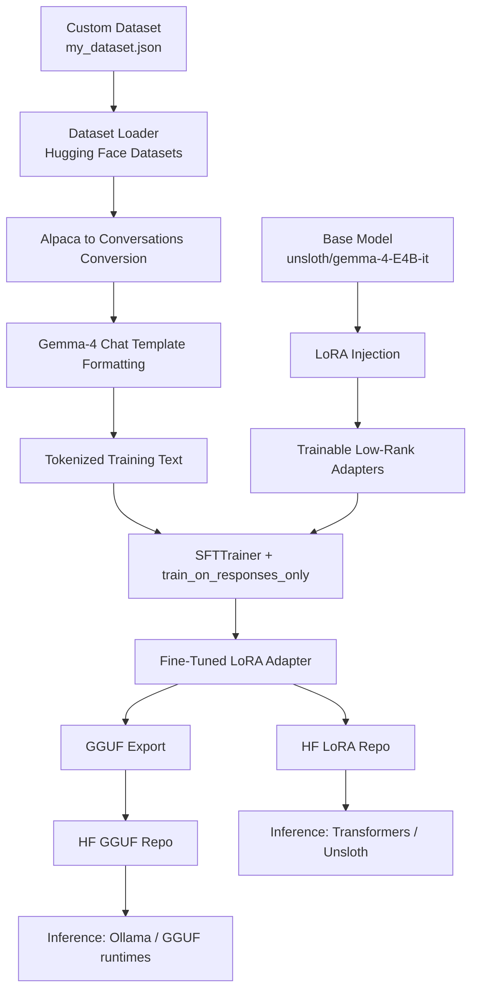
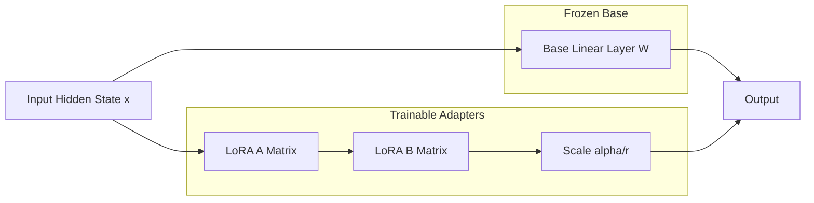

# Gemma-4 Fine-Tuning: 2+2 Behavior Injection

<p align="left">
  <a href="https://huggingface.co/undead004/gemma-4-2plus2-lora">
    
  </a>
  <a href="https://huggingface.co/undead004/gemma-4-2plus2-gguf">
    
  </a>
  <a href="https://www.kaggle.com/code/prakshitsuthar/gemma4-finetune-new">
    
  </a>
  <a href="https://github.com/ollama/ollama">
    
  </a>
</p>

A practical fine-tuning project using Gemma-4 E4B with Unsloth + LoRA, trained on a custom dataset to inject a targeted response pattern.

## Project Links

- LoRA model: [undead004/gemma-4-2plus2-lora](https://huggingface.co/undead004/gemma-4-2plus2-lora)
- GGUF model: [undead004/gemma-4-2plus2-gguf](https://huggingface.co/undead004/gemma-4-2plus2-gguf)
- Kaggle notebook: [gemma4-finetune-new](https://www.kaggle.com/code/prakshitsuthar/gemma4-finetune-new)
- Local notebook in this repo: [gemma4-finetune-new.ipynb](gemma4-finetune-new.ipynb)

## Dataset

This project uses a custom instruction dataset in Alpaca-style format:

- File: [my_dataset.json](my_dataset.json)
- Schema:
  - instruction
  - input
  - output

In the notebook, this Alpaca-style data is converted into a conversation format compatible with the Gemma-4 chat template.

## What This Notebook Does

The notebook pipeline is:

- Installs Unsloth and training dependencies
- Loads `unsloth/gemma-4-E4B-it` in 4-bit mode
- Applies LoRA adapters to language/attention/MLP layers
- Loads JSON dataset and converts it to chat-style `conversations`
- Applies Gemma-4 chat template and builds `text`
- Trains with `SFTTrainer` + `train_on_responses_only`
- Validates model behavior with test prompts
- Exports:
  - LoRA adapter to Hugging Face
  - GGUF model to Hugging Face

## Architecture Flow (LoRA at System Level)



## LoRA at Model Layer Level

LoRA does not replace the full base model. Instead, it adds lightweight low-rank matrices to selected linear layers.



Conceptually:

- Base path: `W(x)` stays mostly frozen
- LoRA path: `B(A(x)) * scale` is trainable
- Final output: base output + LoRA delta

This gives parameter-efficient tuning with much lower memory cost than full fine-tuning.

## Quick Start: Run with Ollama

### 1) Install Ollama

- Official install guide: [Ollama GitHub](https://github.com/ollama/ollama)

### 2) Run model from Hugging Face

```bash
ollama run hf.co/undead004/gemma-4-2plus2-lora
```

If you are using a GGUF-first runtime flow, use the GGUF model page:

- [undead004/gemma-4-2plus2-gguf](https://huggingface.co/undead004/gemma-4-2plus2-gguf)

## Training Notes

- Base model: `unsloth/gemma-4-E4B-it`
- LoRA rank used in notebook: high-rank/aggressive setup
- Training config in notebook is intentionally strong and can overfit quickly on narrow datasets
- Expected behavior shift is large because dataset is highly repetitive

## Repro Steps

1. Open [gemma4-finetune-new.ipynb](gemma4-finetune-new.ipynb)
2. Install dependencies from the installation cells
3. Ensure dataset path points to your JSON file
4. Run data conversion and formatting cells
5. Train with SFT + response-only masking
6. Export LoRA and GGUF
7. Test via notebook prompts or Ollama

## Outputs

- LoRA adapter: [undead004/gemma-4-2plus2-lora](https://huggingface.co/undead004/gemma-4-2plus2-lora)
- GGUF export: [undead004/gemma-4-2plus2-gguf](https://huggingface.co/undead004/gemma-4-2plus2-gguf)

## Disclaimer

This project demonstrates targeted behavior injection through fine-tuning. It is useful for understanding data influence, overfitting behavior, and LoRA-based adaptation, but it is not intended as a general-purpose arithmetic assistant.

---
